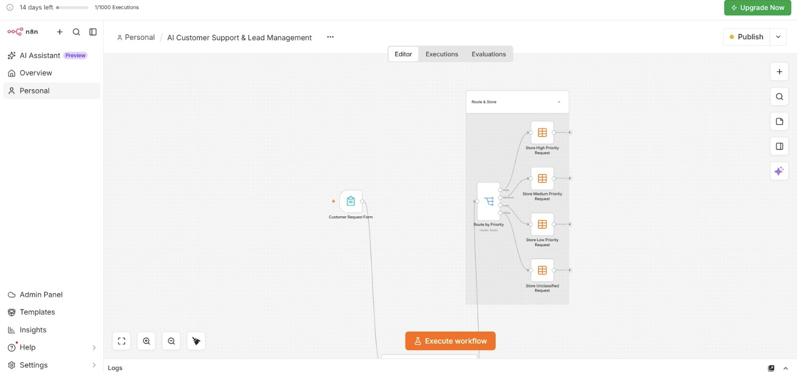
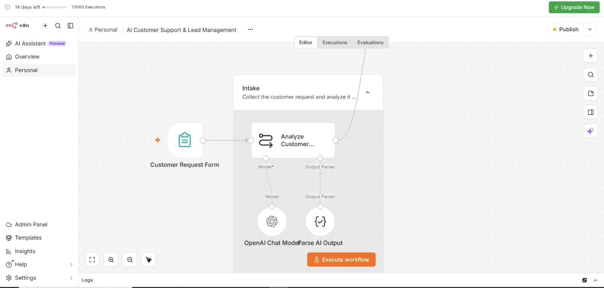
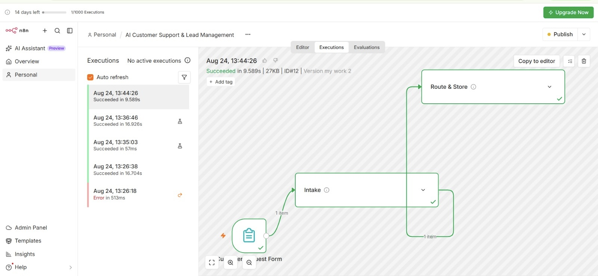
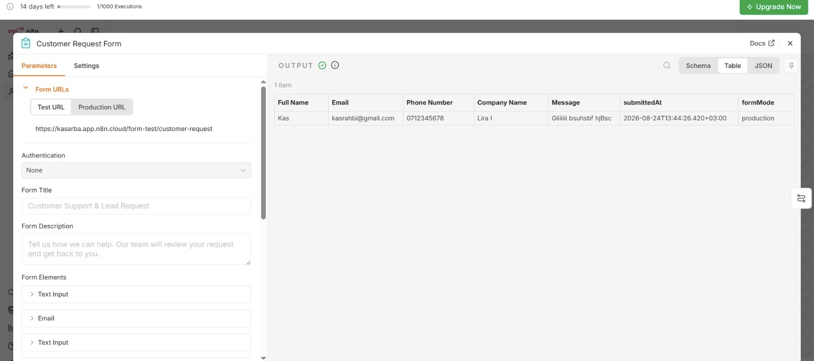
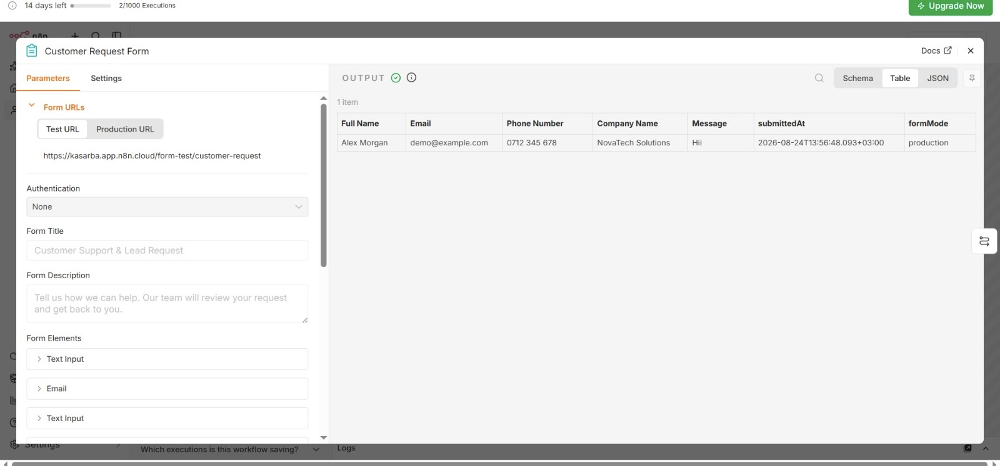

# ai-lead-priority-automation-
AI-powered n8n workflow that analyzes customer requests, classifies lead priority, and automatically routes them for organized follow-up
# AI Lead Priority Automation

An AI-powered n8n workflow that automatically analyzes incoming customer requests, determines their priority, and routes them to the appropriate category.

## 🚀 How It Works

1. A customer submits a request through the Customer Request Form.
2. The request is analyzed using an OpenAI Chat Model.
3. The AI generates structured output using an Output Parser.
4. The workflow classifies the request by priority.
5. The request is automatically routed and stored as High, Medium, Low, or Unclassified priority.

## 🛠️ Technologies Used

- n8n
- OpenAI
- AI-powered request analysis
- Structured Output Parser
- Automated priority routing

## ✨ Features

- Customer request intake form
- AI-powered request analysis
- Automatic lead priority classification
- High / Medium / Low / Unclassified routing
- Automated request storage
- Tested workflow executions

## 🌐 Live Demo

Try the live customer request form:

https://kasarba.app.n8n.cloud/form/customer-request

## 📸 Project Screenshots
## 📸 Workflow Screenshots

### Customer Request Form

### Customer Request Submitted

### AI Request Analysis

### Priority Routing

### Successful Workflow Execution
 
